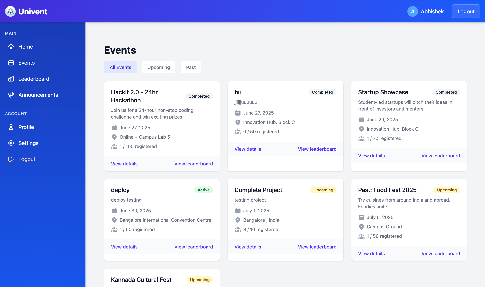
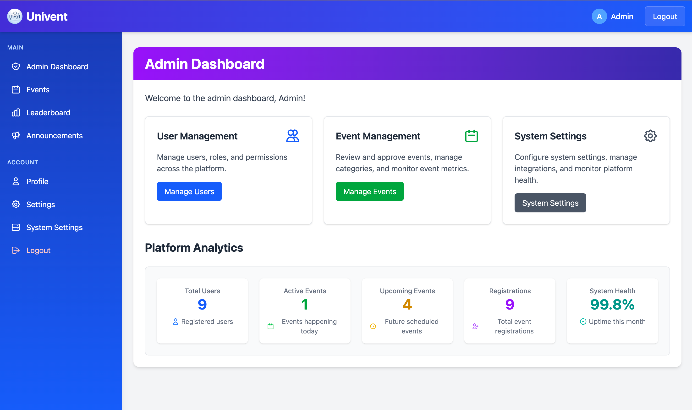
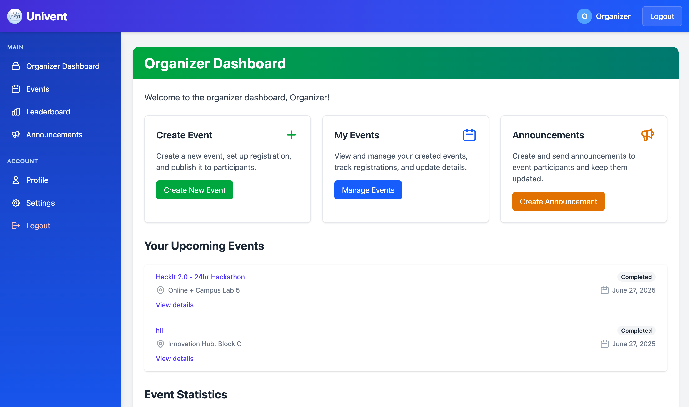
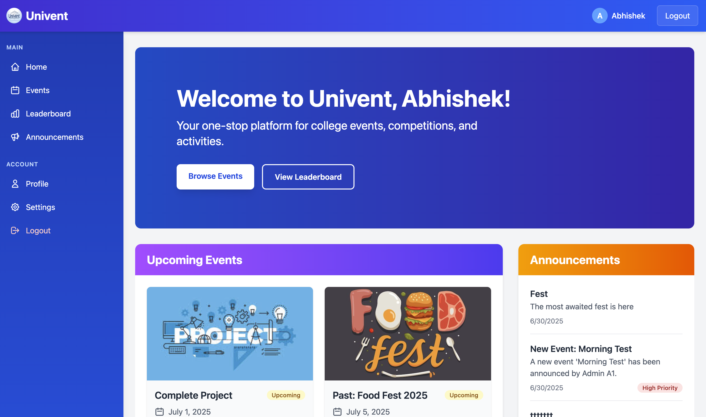

# College Event - Real-Time College Event Management System (MERN Stack)

<div align="center">
  
</div>

<p align="center">
  <a href="https://github.com/AbhishekBalija/Univent/blob/main/LICENSE"></a>
  <a href="#"></a>
  <a href="#"></a>
</p>

## 🚀 Overview
College Event is a comprehensive, real-time event management platform designed specifically for the dynamic environment of colleges and universities. Built on the **MERN stack (MongoDB, Express.js, React.js, Node.js)** with a **microservice architecture**, it provides a centralized system for organizing and participating in college fests, workshops, and technical events. The platform features live announcements and interactive leaderboards to boost engagement and streamline communication between organizers and participants.

This open-source project is a perfect example of a full-stack web application using modern technologies like **Socket.IO for real-time communication** and **JWT for secure authentication**.

## ✨ Key Features
College Event is packed with features to create a seamless event experience:

- 🎫 **Full Event Lifecycle Management**: Create, update, delete, and manage events.
- 📝 **Easy Participant Registration**: Simple, one-click event registration for students.
- 📢 **Real-time Announcements**: Push live updates and announcements to all users instantly.
- 🏆 **Live Gamified Leaderboards**: Dynamic leaderboards that update scores in real-time to foster competition.
- 👥 **Role-based Access Control (RBAC)**: Distinct roles for Admins, Organizers, and Participants with specific permissions.
- 📱 **Instant Notifications**: Real-time notifications for event registrations, updates, and more.
- 📊 **Event Analytics Dashboard**: Organizers can view registration statistics and engagement metrics.

<div align="center">
  
  <p><em>Event Management Interface for College Fests</em></p>
</div>

## 🛠️ Technology Stack
This project uses a modern and scalable technology stack:

- **Frontend**: **React.js** with **TailwindCSS** for a responsive and beautiful UI.
- **Backend**: **Node.js** with **Express.js** for building robust APIs.
- **Database**: **MongoDB Atlas** (Cloud) with Mongoose for flexible, schema-based data storage.
- **Real-time Communication**: **Socket.IO** for WebSocket-based live updates.
- **Authentication**: **JWT (JSON Web Tokens)** for secure, stateless authentication.
- **Containerization**: **Docker** and Docker Compose for easy setup and deployment.

## 🏛️ System Architecture
College Event is designed using a **microservice architecture** to ensure scalability, maintainability, and independent deployment of services. An **API Gateway** acts as a single entry point for all client requests, routing them to the appropriate downstream service.

- **Authentication Service** (Port 8001): Manages user registration, login, and JWT token generation.
- **Event Service** (Port 8002): Handles all CRUD operations for events and manages participant registrations.
- **Notification Service** (Port 8003): Powers real-time announcements and user notifications via Socket.IO.
- **Leaderboard Service** (Port 8004): Manages participant scoring, ranking calculations, and live leaderboard updates.
- **Settings Service** (Port 8005): Handles user and system settings.
- **API Gateway** (Port 8000): Routes requests to appropriate microservices.

## 🏁 Getting Started

### Prerequisites
- Node.js (v14 or higher)
- MongoDB Atlas account (free tier available)
- npm or yarn
- Git

### Installation Guide

1.  **Clone the repository:**
    ```bash
    git clone https://github.com/AbhishekBalija/Univent.git
    cd Univent-College_Event_Management_System-main
    ```

2.  **Install frontend dependencies:**
    ```bash
    cd frontend
    npm install
    ```

3.  **Install backend dependencies for each microservice:**
    ```bash
    cd ../backend/auth-service && npm install
    cd ../event-service && npm install
    cd ../notification-service && npm install
    cd ../leaderboard-service && npm install
    cd ../settings-service && npm install
    cd ../gateway && npm install
    ```

4.  **Environment Variables Setup:**
    
    The `.env` files are already configured in each service directory. Key configurations:
    
    **MongoDB Atlas Connection:**
    - All services are connected to MongoDB Atlas cloud database
    - Each service uses a separate database for data isolation
    
    **JWT Secret:**
    - Default: `your_super_secret_jwt_key_change_this_in_production`
    - ⚠️ Change this in production!
    
    **Service Ports:**
    - Gateway: 8000
    - Auth Service: 8001
    - Event Service: 8002
    - Notification Service: 8003
    - Leaderboard Service: 8004
    - Settings Service: 8005
    - Frontend: 5173

5.  **Create Test Users (Optional but Recommended):**
    
    Run the seed script to create admin, organizer, and participant test accounts:
    ```bash
    cd backend/auth-service
    node seedUsers.js
    ```

6.  **Run the Application:**
    
    **Option 1: Start services individually (Recommended for development)**
    
    Open separate terminal windows for each service:
    
    ```bash
    # Terminal 1: Frontend
    cd frontend && npm run dev
    
    # Terminal 2: Gateway
    cd backend/gateway && npm run dev
    
    # Terminal 3: Auth Service
    cd backend/auth-service && npm run dev
    
    # Terminal 4: Event Service
    cd backend/event-service && npm run dev
    
    # Terminal 5: Notification Service
    cd backend/notification-service && npm run dev
    
    # Terminal 6: Leaderboard Service
    cd backend/leaderboard-service && npm run dev
    
    # Terminal 7: Settings Service
    cd backend/settings-service && npm run dev
    ```
    
    **Option 2: Start all services using Docker (Coming Soon)**
    ```bash
    docker-compose up
    ```

7.  **Access the Application:**
    
    Open your browser and navigate to: `http://localhost:5173`

## 👤 User Roles and Permissions

The system has three distinct user roles:

| Role | Access Level | Responsibilities |
|:--- |:--- |:--- |
| **Admin** | Full system access | Manages users, roles, and system-wide settings. Can promote users to organizer or admin roles. |
| **Organizer** | Event-level access | Creates and manages their own events, tracks participants, makes announcements, updates leaderboard scores. |
| **Participant** | Basic access | Registers for events, views leaderboard, receives notifications. |

### Test Accounts

After running the seed script (`node seedUsers.js`), you can use these test accounts:

**Admin Account:**
- Email: `admin@univent.com`
- Password: `Admin@123456`
- Role: Full system access

**Organizer Account:**
- Email: `organizer@univent.com`
- Password: `Organizer@123456`
- Role: Can create and manage events

**Participant Account:**
- Email: `participant@univent.com`
- Password: `Participant@123456`
- Role: Can register for events

⚠️ **Important:** Change these passwords after first login in production!

<div align="center">
  <table>
    <tr>
      <td align="center">
        <br>
        <em>Admin Dashboard</em>
      </td>
      <td align="center">
        <br>
        <em>Organizer Dashboard</em>
      </td>
      <td align="center">
        <br>
        <em>Participant Home</em>
      </td>
    </tr>
  </table>
</div>

## 📂 Project Structure
The repository is organized into a `frontend` directory for the React client and a `backend` directory containing the microservices.

```
Univent-College_Event_Management_System-main/
├── frontend/             # React.js client application
│   ├── src/
│   ├── components/       # Reusable React components
│   ├── pages/            # Page-level components
│   └── services/         # API service functions
│
├── backend/
│   ├── auth-service/     # Handles user authentication & roles
│   ├── event-service/    # Handles event CRUD and registration
│   ├── notification-service/ # Real-time notifications via Socket.IO
│   ├── leaderboard-service/  # Manages scoring and ranking
│   ├── settings-service/ # User and system settings
│   └── gateway/          # API Gateway for routing
│
└── README.md
```

## 🔧 Configuration

### MongoDB Atlas Setup

1. Create a free account at https://www.mongodb.com/cloud/atlas
2. Create a cluster (M0 free tier)
3. Create a database user
4. Whitelist your IP address (0.0.0.0/0 for development)
5. Get your connection string
6. The connection strings are already configured in the `.env` files

### Email Configuration (Optional)

For password reset functionality, configure email settings in `backend/auth-service/.env`:

```env
EMAIL_HOST=smtp.gmail.com
EMAIL_PORT=587
EMAIL_USER=your_email@gmail.com
EMAIL_PASSWORD=your_gmail_app_password
```

### Google OAuth (Optional)

For "Sign in with Google" feature:

1. Go to https://console.cloud.google.com/
2. Create OAuth 2.0 credentials
3. Add to `backend/auth-service/.env`:
```env
GOOGLE_CLIENT_ID=your_client_id
GOOGLE_CLIENT_SECRET=your_client_secret
```

## 🚀 Deployment

### Frontend Deployment (Vercel)
```bash
cd frontend
npm run build
# Deploy the dist folder to Vercel
```

### Backend Deployment (Render/Railway)
Each microservice can be deployed independently to platforms like Render, Railway, or Heroku.

## 🤝 Contributing

Contributions are welcome! Please feel free to submit a Pull Request.

## 📜 License
This project is licensed under the MIT License. See the [LICENSE.md](LICENSE.md) file for more details.

## 📧 Contact

- Email: info@collegeevent.com
- Phone: +251 91 123 4567
- Address: Addis Ababa University, Addis Ababa, Ethiopia

## 🙏 Acknowledgments

- Built with ❤️ for college communities
- Special thanks to all contributors
- Inspired by the need for better event management in educational institutions
